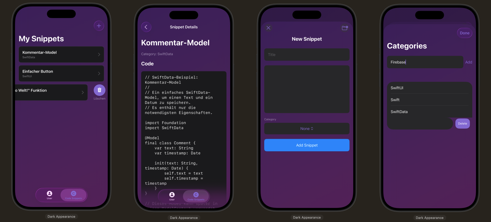

# CodeSnippet  

  
  
  
  
  
  

  

This SwiftUI app lets users **create, organize, and store their own code snippets**. ✨  
Each snippet can be assigned to a **custom category**, making it easier to manage and reuse code.  
The app also includes a **login & registration system**, so users can securely access their personal snippet collections.  

This project was developed as part of my training.  

## Features  

- ✅ Create and save personal code snippets  
- ✅ Create custom categories and assign them to snippets  
- ✅ Full login and registration system  
- ✅ Anonymous login support via **Firebase**  
- ✅ Persistent storage with **Firestore Database**  
- ✅ Integration of **Crashlytics** for error and crash reporting  

## Technologies  

- SwiftUI  
- Firebase Authentication  
- Firestore Database  
- Crashlytics Integration  
- MVVM architecture  
- @State, @Binding for state management  
- Lists, forms, and navigation for UI  

## How to Run  

1. Click the green **"Code"** button on this repository and select **"Open with Xcode"** (if available), or download the ZIP and open the project manually.  
2. Alternatively, open the `.xcodeproj` or `.xcworkspace` file directly in **Xcode**.  
3. Click the **Run** ▶️ button in the top toolbar to build and launch the app in the iOS Simulator or on a physical device.  
4. Use the app to create snippets, assign them to categories, and manage your personal snippet library.  

---

📝 Disclaimer  

This project was developed as part of my training. The source code, structure, and documentation are my own work.  

© 2025 Jeff Braun. All rights reserved. Licensed under the [MIT License](./LICENSE).  
